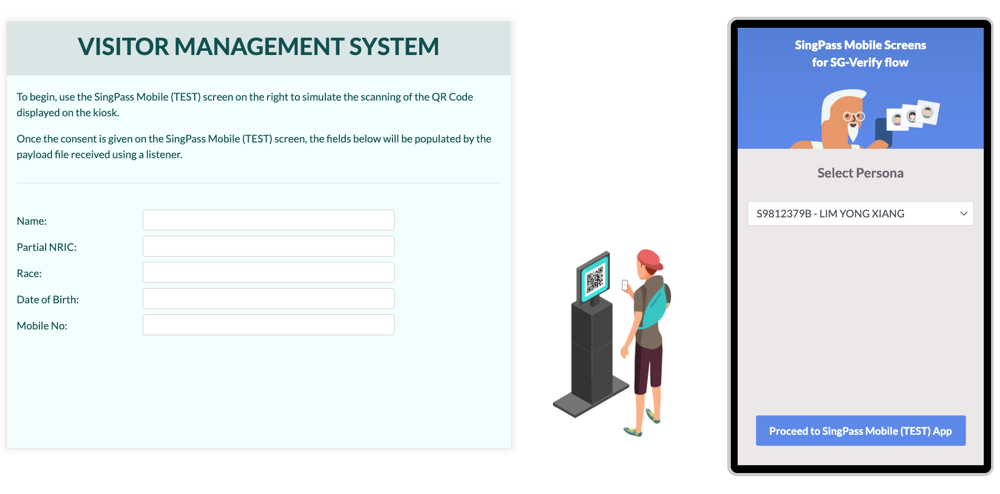

## SG Verify Demo App Setup

### 1.1 Install Node and NPM

In order for the demo application to run, you will need to install Node and NPM.

Follow the instructions given by the links below depending on your OS.

- [Install Node and NPM for Windows](http://blog.teamtreehouse.com/install-node-js-npm-windows)
- [Install Node and NPM for Linux](http://blog.teamtreehouse.com/install-node-js-npm-linux)
- [Install Node and NPM for Mac](http://blog.teamtreehouse.com/install-node-js-npm-mac)


### 1.2 Run NPM install

Run the following command in the folder you unzipped the application:

```
npm install
```

### 1.3 Start the Application

Execute the following command to start the application:
```
npm start
```

**Access the Application on Your Browser**
You should be able to access the sample application via the following URL:

```
http://localhost:3001
```




---
## Enable Payload Encryption & Signing

**Mock MyInfo**
Edit the ``mock-myinfo/config/config.js``. Look for ``Without encryption and signing``, comment out these configurations,
```
config.security.encryption = false;
```


Look for ``With encryption and signing``, uncomment out these configurations,
```
// config.security.encryption = true;
```

**Webhook**
Edit the ``webhook/config/config.js``. Look for ``Without encryption and signing``, comment out these configurations,
```
config.security.encryption = false;
```


Look for ``With encryption and signing``, uncomment out these configurations,
```
// config.security.encryption = true;
```

## Reporting issues

You may contact [support@myinfo.gov.sg](mailto:support@myinfo.gov.sg) for any other technical issues, and we will respond to you within 5 working days.
